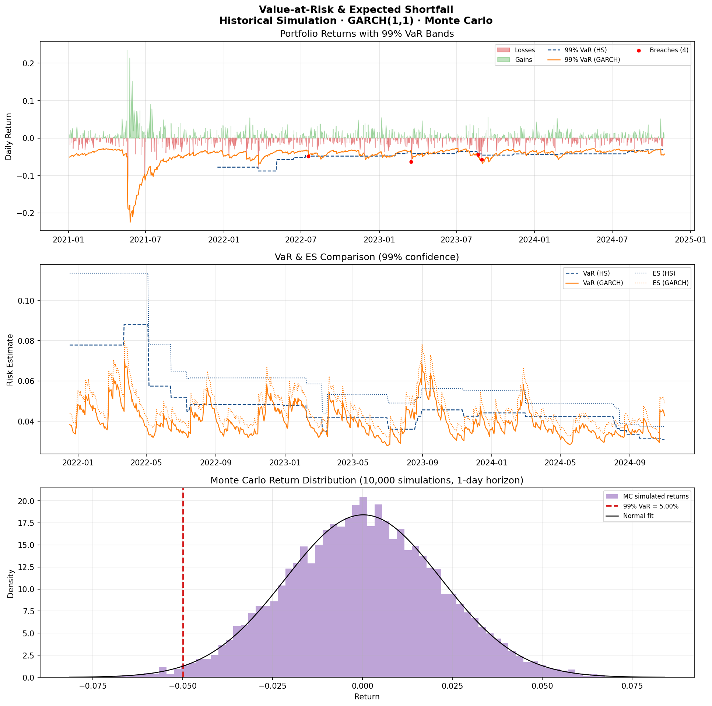

# Value-at-Risk & Expected Shortfall

Three VaR methodologies (Historical Simulation, GARCH(1,1) parametric, Monte Carlo) applied to a simulated equity portfolio with GARCH volatility clustering, plus formal backtesting via the Kupiec proportion-of-failures test.



## Methods implemented

### 1. Historical Simulation (HS)
Uses the empirical distribution of the past 250 trading days. No distributional assumptions — but slow to adapt to volatility regime changes.

### 2. GARCH(1,1) Parametric
Estimates time-varying volatility σₜ using maximum likelihood:

```
σ²ₜ = ω + α·ε²ₜ₋₁ + β·σ²ₜ₋₁
```

Fitted parameters: **ω = 1.21×10⁻⁵, α = 0.089, β = 0.885** → persistence = 0.974 (typical for equity returns)

**99% VaR** = −z₀.₀₁ · σₜ  
**99% ES** = σₜ · φ(z₀.₀₁) / 0.01

### 3. Monte Carlo (10,000 simulations)
Samples from the fitted normal distribution. Useful for multi-asset portfolios and non-linear instruments.

## Backtesting — Kupiec Test

The Proportion of Failures (POF) test checks whether the observed breach rate matches the theoretical rate under H₀.

| Method | Breaches | Expected | p-value | Result |
|--------|----------|----------|---------|--------|
| Historical Simulation | 4 / 1000 | 10 | 0.030 | **FAIL** |
| GARCH(1,1) | 12 / 1000 | 10 | 0.538 | **PASS** |

GARCH passes because it adapts to volatility clustering — HS underestimates risk in calm periods and overestimates it in volatile ones.

## How to run

```bash
pip install -r requirements.txt
python var_es.py
```

## Using real data

```python
import yfinance as yf
prices = yf.download("^STI", start="2018-01-01")["Close"]
returns = prices.pct_change().dropna().rename("portfolio_return")
```

## Regulatory context

- **Basel III / FRTB**: banks must use ES at 97.5% rather than VaR at 99% (ES is more sensitive to tail risk)
- **MAS Notice 637**: Singapore banks report VaR and stressed VaR under MAS guidelines
- GARCH-based models are widely used in bank internal models; HS is the standard for smaller desks

## Extensions

- GARCH-t (Student-t innovations for fatter tails)
- Filtered Historical Simulation (combine GARCH with empirical residuals)
- Christoffersen conditional coverage test (tests both frequency and independence of breaches)
